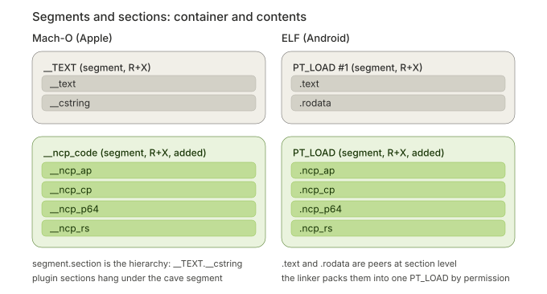
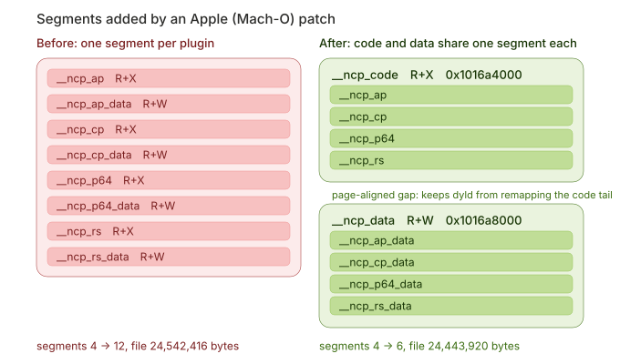
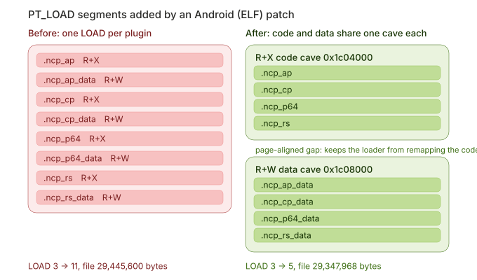

# ArmCaveHook

<p align="center">
  
  
  
  
  
  
  
  
  
</p>

English | [简体中文](README_CN.md)

ArmCaveHook is an ARM64/AArch64 static binary patch framework for 64-bit Apple
Mach-O and Android ELF binaries. It compiles C++ plugins, supports direct AArch64
assembly patches, creates isolated code and data segments, and writes the patched binary.

## Quick Start

```bash
git clone --recursive https://github.com/SweelLong/ArmCaveHook.git
cd ArmCaveHook
./build.sh
```

Select an enabled profile in `armcave.conf` before building.

```cpp
#include "armcave.h"

extern "C" int replacement(int value) { return value + 1; }

extern "C" void init(void) {
    hook_replace(0x100000498, replacement, w0);
}
```

The framework currently supports Apple Mach-O and Android ELF injection, AArch64
decoding, relocation, CFG/function analysis, far branches, isolated plugin code
and data segments, symbol and PLT/GOT lookup, byte signatures, Mach-O chained
fixups, Objective-C and Swift metadata, `patch.toml`, and structured diagnostics.

Planned work includes code-signing workflow guidance, byte-signature stability
guidance, optional cross-version address assistance, a lightweight C++ plugin
toolkit, and broader Android ELF coverage for DT_RELR and `eh_frame`.

## Segments and sections: container and contents

A **section** is a fine-grained logical unit that serves the linker and the
debugger; it describes the attributes of code, data or debug information. A
**segment** is a coarse-grained loading unit that serves the kernel loader and
the dynamic linker; it groups sections that share the same memory permissions
(read / write / execute) so they can be mapped into memory in one go. A segment
contains zero or more sections — what the linker really does is pack sections
into segments by permission.

How visible that relationship is depends on the format:

- **Mach-O (Apple): the hierarchy is in the name.** `__TEXT` is a segment and
  `__text` / `__cstring` are sections inside it, so IDA shows
  `__TEXT.__cstring`. The question "are the strings inside the code?" has a
  definite answer here: strings live in the `__cstring` section of the `__TEXT`
  segment, a sibling of the code section `__text` under the same segment.
- **ELF (Android) and PE: sections are peers.** `.text` and `.rodata` are two
  independent sections with no containment relationship. They are only packed
  into the same R+X `PT_LOAD` at link time, and share one mapping at run time.
  Occasionally a compiler drops string constants straight into `.text` to reuse
  its read-only, pre-initialized nature — that is a special case inside a
  section, not a format-level hierarchy.

ArmCaveHook caves follow the same model:

<p align="center">
  
</p>

- Mach-O: the two added segments `__ncp_code` (R+X) and `__ncp_data` (R+W) hold
  the plugin sections, so IDA shows `__ncp_code.__ncp_ap`.
- ELF: the two added `PT_LOAD` entries hold plugin sections that stay peers at
  section level (`.ncp_ap` and friends) but are mapped together by one R+X
  segment.

### How cave names are derived

The shared cave name is **not hardcoded**; it is derived from the plugin segment
names taking part in the patch run:

1. take the **longest common prefix** of all plugin segment names and strip the
   platform prefix (`__` / `.`);
2. append `_` if the remaining prefix does not end with one;
3. append `code` / `data` — giving `<common prefix>_code` and
   `<common prefix>_data`.

| Plugin segment names | Common prefix | Cave names |
| --- | --- | --- |
| `__ncp_ap`, `__ncp_cp`, `__ncp_p64`, `__ncp_rs` | `ncp_` | `__ncp_code` / `__ncp_data` |
| a single plugin `__ncp_rs` | `ncp_rs` → `ncp_rs_` | `__ncp_rs_code` / `__ncp_rs_data` |
| `__ncp_rs` and `__zzzplay` (nothing in common) | — | falls back to `__armcave_code` / `__armcave_data` |

The Mach-O segment name field is 16 bytes, so the logical prefix is capped at
9 characters (2 + 9 + `_` + 4 = 16) and truncated beyond that.

The Android (ELF) side splits caves by the same rule, but a `PT_LOAD` has **no
name field**, so the derived name has nowhere to appear — the cave is identified
by that one `PT_LOAD`, and plugin sections keep their `.` + logical name (see
[segment naming](docs/segments.md)). The rule is the same on both targets; only
ELF has no place to show it.

In IDA: **View → Open subviews → Segments** shows segments (the load view, with
permissions), while **Ctrl+S** (or Shift+F7) lists sections (the link view). The
`__TEXT.__cstring` or `__ncp_code.__ncp_ap` label next to an address in the
disassembly is exactly the segment.section pair.

## Segment layout (Mach-O and ELF)

On both targets a single patch run adds exactly two containers: two
`LC_SEGMENT_64` entries on Mach-O and two `PT_LOAD` entries on ELF. Every plugin
code section is packed into one R+X cave and every writable data section into one
R+W cave. The cave count does not grow with the plugin count.

**Apple (Mach-O)**: `__ncp_code` (R+X) plus `__ncp_data` (R+W)

<p align="center">
  
</p>

**Android (ELF)**: one R+X cave plus one R+W cave

<p align="center">
  
</p>

The two caves are separated by a page-aligned gap. The loader maps every segment
over page-rounded boundaries, so if both caves shared a page the data mapping
would remap the tail page of the code cave as R+W and that code would no longer
be executable.

Both charts come from patching with four plugins. Mach-O: segments 4 → 12
(24,542,416 bytes) became 4 → 6 (24,443,920 bytes). ELF: LOAD 3 → 11
(29,445,600 bytes) became 3 → 5 (29,347,968 bytes). The Mach-O side also saves
load command space: eight 152-byte commands became two commands totalling
784 bytes.

## Documentation

- [Architecture](docs/architecture.md)
- [API reference](docs/api-reference.md)
- [Hook API](docs/hook-api.md)
- [Segment naming](docs/segments.md)
- [Build configuration and diagnostics](docs/configuration-and-diagnostics.md)

## Requirements

- CMake 3.24 or newer
- C++17 compiler
- Clang and Clang++ for AArch64 plugin objects

## License

MIT
