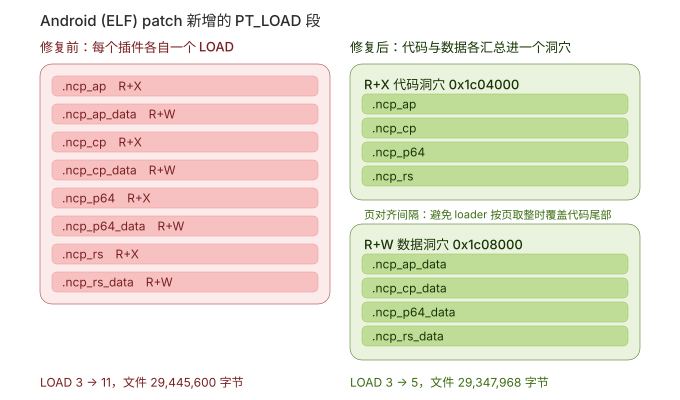

# ArmCaveHook

<p align="center">
  
  
  
  
  
  
  
  
  
</p>

[English](README.md) | 简体中文

ArmCaveHook 是面向 64 位 Apple Mach-O 与 Android ELF 二进制的 ARM64/AArch64 静态补丁框架。
它编译 C++ 插件，支持直接写 AArch64 汇编 patch，创建相互隔离的代码段和数据段，并输出已修补的二进制文件。

## 快速开始

```bash
git clone --recursive https://github.com/SweelLong/ArmCaveHook.git
cd ArmCaveHook
./build.sh
```

构建前，请在 `armcave.conf` 中启用需要的平台 profile。

```cpp
#include "armcave.h"

extern "C" int replacement(int value) { return value + 1; }

extern "C" void init(void) {
    hook_replace(0x100000498, replacement, w0);
}
```

当前已支持 Apple Mach-O 与 Android ELF 注入、AArch64 解码/重定位/CFG 和函数分析、远跳序列、
隔离的插件代码段与数据段、符号和 PLT/GOT 查找、字节签名、Mach-O chained fixup、Objective-C
与 Swift metadata、`patch.toml` 以及结构化诊断。

后续计划包括代码签名流程说明、字节签名稳定性指导、可选的跨版本地址辅助工具、轻量 C++ 插件
工具集，以及对 Android ELF 的 DT_RELR 和 `eh_frame` 等支持扩展。

## Android ELF 段布局

Android（ELF）目标下，一次 patch 只会新增两个 `PT_LOAD`：所有插件代码段打包进一个 R+X 洞穴，
所有可写数据段打包进一个 R+W 洞穴。洞穴数量与插件数量无关，不会每多一个插件就多一个 LOAD。

<p align="center">
  
</p>

两个洞穴之间按页对齐。loader 会按页取整映射每个 `PT_LOAD`，如果两个洞穴落在同一页，数据段的
映射会把代码洞穴的尾页重新映射成 R+W，那段代码将无法执行。

上图的数字来自 `libcocos2dcpp.so` 打 4 个插件的实测结果：修复前 LOAD 3 → 11（文件 29,445,600
字节），修复后 LOAD 3 → 5（文件 29,347,968 字节）。

## 文档

- [架构](docs/architecture_CN.md)
- [API 参考](docs/api-reference_CN.md)
- [Hook API](docs/hook-api_CN.md)
- [段名规则](docs/segments_CN.md)
- [构建配置与诊断](docs/configuration-and-diagnostics_CN.md)

## 环境要求

- CMake 3.24 或更新版本
- C++17 编译器
- 用于生成 AArch64 插件对象的 Clang 和 Clang++

## License

MIT
