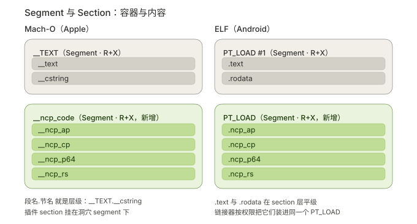
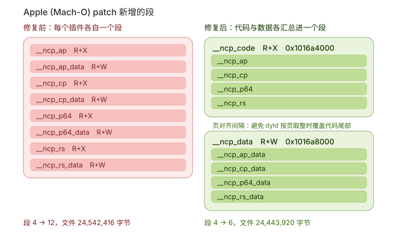
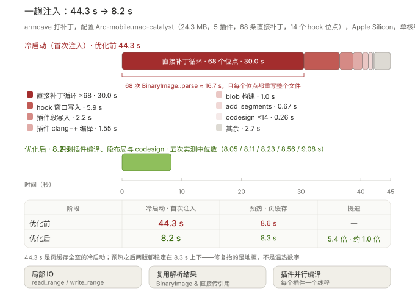

# ArmCaveHook

<p align="center">
  
  
  
  
  
  
  
  
  
</p>

[English](README.md) | 简体中文

ArmCaveHook 是面向 64 位 Apple Mach-O 与 Android ELF 二进制的 ARM64/AArch64 静态补丁框架。
它编译 C++ 插件，支持直接写 AArch64 汇编 patch，创建相互隔离的代码段和数据段，并输出已修补的二进制文件。

## 快速开始

```bash
git clone --recursive https://github.com/SweelLong/ArmCaveHook.git
cd ArmCaveHook
./build.sh
```

构建前，请在 `armcave.conf` 中启用需要的平台 profile。

```cpp
#include "armcave.h"

extern "C" int replacement(int value) { return value + 1; }

extern "C" void init(void) {
    hook_replace(0x100000498, replacement, w0);
}
```

当前已支持 Apple Mach-O 与 Android ELF 注入、AArch64 解码/重定位/CFG 和函数分析、远跳序列、
隔离的插件代码段与数据段、符号和 PLT/GOT 查找、字节签名、Mach-O chained fixup、Objective-C
与 Swift metadata、`patch.toml` 以及结构化诊断。

后续计划包括代码签名流程说明、字节签名稳定性指导、可选的跨版本地址辅助工具、轻量 C++ 插件
工具集，以及对 Android ELF 的 DT_RELR 和 `eh_frame` 等支持扩展。

## Segment 与 Section：容器与内容

**Section（节）** 是细粒度的逻辑单元，主要服务于链接器和调试器，描述代码、数据、调试信息的
属性；**Segment（段）** 是粗粒度的加载单元，主要服务于内核加载器和动态链接器，它按内存权限
（可读 / 可写 / 可执行）把一批属性相同的 Section 打包在一起，运行时一次性映射进内存。一个
Segment 可以包含零个或多个 Section——链接器做的事，本质就是把多个 Section 按权限"打包"成
Segment。

这层关系在两种格式里的**可见性**不一样：

- **Mach-O（Apple）：隶属关系写在命名里。** `__TEXT` 是 Segment，`__text` 和 `__cstring`
  是它下面的 Section，IDA 里直接显示为 `__TEXT.__cstring`。所以"字符串是不是在代码段里"这个
  问题在 Mach-O 上是明确的：字符串在 `__TEXT` 段的 `__cstring` 节里，与代码节 `__text` 平级，
  同属一个 Segment。
- **ELF（Android）/ PE：Section 层面是平级的。** `.text` 与 `.rodata` 是两个彼此独立的
  Section，没有包含关系；只有在链接时它们才被按权限打包进同一个 R+X 的 `PT_LOAD`，在内存里
  共享一次映射。个别情况下编译器会把字符串常量直接塞进 `.text`（利用它"只读且已初始化"的
  属性），那是 Section 内部的特例，不是格式层面的隶属。

ArmCaveHook 自己开的洞穴遵循同一套模型：

<p align="center">
  
</p>

- Mach-O：新增 `__ncp_code`（R+X）与 `__ncp_data`（R+W）两个 Segment，四个插件代码 Section
  挂在 `__ncp_code` 下，在 IDA 里就是 `__ncp_code.__ncp_ap`。
- ELF：新增两个 `PT_LOAD`，四个插件代码 Section（`.ncp_ap` 等）在 Section 层面彼此平级，
  只是被同一个 R+X 的 LOAD 装起来一起映射。

### 洞穴名的推导规则

共享洞穴的名字**不是写死的**，而是从本次参与 patch 的插件段名里推导出来的：

1. 取所有插件段名的**最长公共前缀**，去掉平台前缀（`__` / `.`）后得到逻辑前缀；
2. 逻辑前缀不以 `_` 结尾就补一个 `_`；
3. 拼上 `code` / `data` —— 即 `<公共前缀>_code` 和 `<公共前缀>_data`。

| 插件段名 | 公共前缀 | 洞穴名 |
| --- | --- | --- |
| `__ncp_ap`、`__ncp_cp`、`__ncp_p64`、`__ncp_rs` | `ncp_` | `__ncp_code` / `__ncp_data` |
| 只有一个插件 `__ncp_rs` | `ncp_rs` → `ncp_rs_` | `__ncp_rs_code` / `__ncp_rs_data` |
| `__ncp_rs` 与 `__zzzplay`（无公共前缀） | — | 回退 `__armcave_code` / `__armcave_data` |

Mach-O 的段名字段固定 16 字节，所以逻辑前缀最多保留 9 个字符（2 + 9 + `_` + 4 = 16），
超出会被截断。

Android（ELF）侧的洞穴同样按这条规则划分，但 `PT_LOAD` **没有名字字段**，所以推导结果无处
显示——洞穴的身份由那一个 `PT_LOAD` 表达，插件 Section 名仍是 `.` + 逻辑名（见
[段名规则](docs/segments_CN.md)）。换句话说：规则两端一致，只是 ELF 侧看不见名字。

在 IDA 里查看：**View → Open subviews → Segments** 看的是 Segment（加载视角，带权限）；
**Ctrl+S**（或 Shift+F7）打开的列表是 Section（链接视角）。反汇编视图地址旁显示的
`__TEXT.__cstring`、`__ncp_code.__ncp_ap` 就是"段.节"。

## 段布局（Mach-O 与 ELF）

两种目标下，一次 patch 都只会新增两个容器：Mach-O 新增 2 个 `LC_SEGMENT_64`，ELF 新增 2 个
`PT_LOAD`。所有插件代码段打包进一个 R+X 洞穴，所有可写数据段打包进一个 R+W 洞穴，洞穴数量与
插件数量无关。

**Apple（Mach-O）**：`__ncp_code`（R+X）+ `__ncp_data`（R+W）

<p align="center">
  
</p>

**Android（ELF）**：一个 R+X 洞穴 + 一个 R+W 洞穴

<p align="center">
  
</p>

两个洞穴之间按页对齐。loader 会按页取整映射每个段，如果两个洞穴落在同一页，数据段的映射会把
代码洞穴的尾页重新映射成 R+W，那段代码将无法执行。

上面两图的数字都来自打 4 个插件的实测结果：Mach-O 段 4 → 12（文件 24,542,416 字节）变为
4 → 6（24,443,920 字节）；ELF 的 LOAD 3 → 11（29,445,600 字节）变为 3 → 5（29,347,968 字节）。
Mach-O 侧顺带还省了 load command 空间：8 条 152 字节命令变 2 条共 784 字节。

## 注入性能

打补丁慢**不是** C++ 编译慢。`armcave` 工具本身冷编译只要约 4.4 秒（增量 0.1 秒），
耗时全在注入阶段。

<p align="center"></p>

根因是所有写路径都复用同一对函数：`read_file()`（`ifstream` 读**整个**文件）和
`write_file()`（`ofstream` 以 `ios::trunc` 打开，重写**整个**文件）。对一个 24 MB
的目标打 68 条直接补丁，等于把镜像读了 68 遍、重写了 68 遍（约 4.9GB IO），
而且每轮还要从头解析一遍 Mach-O（每次 246ms，`BinaryImage::parse` 会读完整镜像并建符号表）。

上面是 Apple 配置（`Arc-mobile.mac-catalyst`，5 个插件，68 条直接补丁，14 个 hook 位点）
在 Apple Silicon 上一次完整注入的耗时分解，单核约 96% 占用。阶段数字来自保序的差量计时：
在 `pipeline.cpp` / `compiler.cpp` / `patcher.cpp` 里给每段插上同样的计时器，把这三个
目标文件单独编进 `build/CMakeFiles/armcave.dir/src/` 再 link 即可，不必清目录。

### 优化项

1. **局部 IO 代替整文件重写**：新增 `read_range()` / `write_range()`（以
   `binary|in|out` 打开 `fstream`，seek 到目标偏移再写）。`write_at_offset()` 和
   三个补丁写入函数现在只碰自己要改的那几个字节。
2. **复用解析结果**：`patch_hook_window()` / `patch_call_window()` /
   `patch_bytes_va()` / `matches_expected()` 改成接收 `BinaryImage &` 而不是路径，
   直接补丁循环只解析一次最终布局，不再每个位点解析一次。
3. **插件并行编译**：插件之间互不依赖，用 `std::thread` 并发 fork `clang++`。
   并行产出的 `.o` 与串行编译逐字节一致。

### 产物等价性

用同一份源码、**只**回退性能改动构建的对照二进制，产出的文件与优化版在偏移
24,378,087 之前逐字节完全一致；之后全部落在 Mach-O 尾部的 ad-hoc 代码签名区
（code directory 内嵌时间戳），而**同一份**优化二进制连跑两次在那一区也有同样量级的差异。

这次比对还顺带挖出一个 latent bug 值得记一笔：`parse_binary()` 每次调用都给函数内
`static unique_ptr` 重新赋值，所以跨过下一次 `parse_binary()` 之后还持有着的
`BinaryImage &` 就是悬空引用。hook 窗口写入现在改用刚解析出来的镜像。

## 文档

- [架构](docs/architecture_CN.md)
- [API 参考](docs/api-reference_CN.md)
- [Hook API](docs/hook-api_CN.md)
- [段名规则](docs/segments_CN.md)
- [构建配置与诊断](docs/configuration-and-diagnostics_CN.md)

## 环境要求

- CMake 3.24 或更新版本
- C++17 编译器
- 用于生成 AArch64 插件对象的 Clang 和 Clang++

## License

MIT
